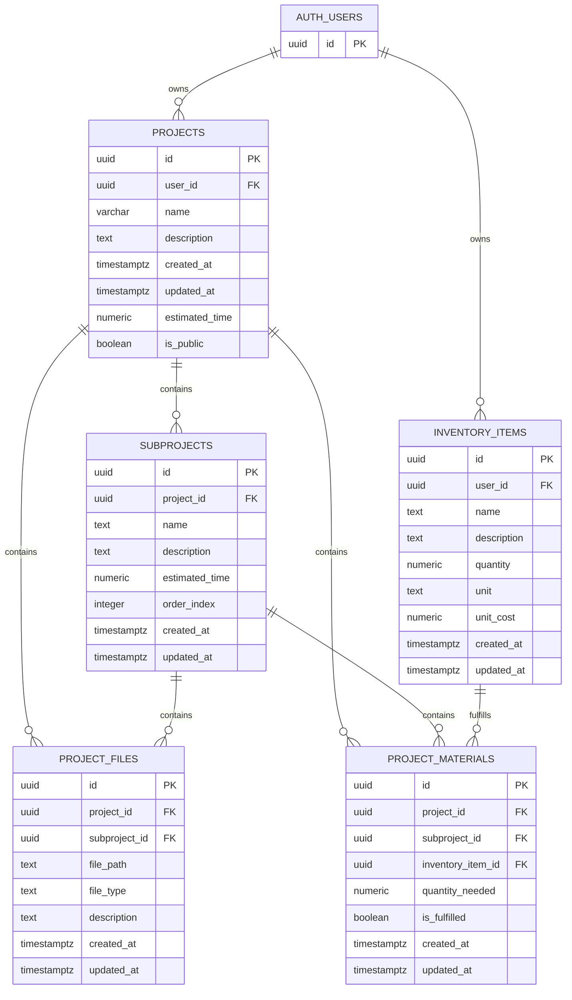

# Project Pantry

<a href="https://project-pantry-e2d5a.web.app" target="_blank">
  
</a>

Project Pantry is a project-planning app for DIY work. You can break a project into subprojects, track materials, and keep everything organized in one place.

## Key Features

- Nested project planning with subprojects and per-scope material tracking
- Inventory-aware material fulfillment with quantity checks
- Auth-protected project and inventory management views
- Project reporting with cost rollups based on material unit costs

## Why I Built It

I wanted a cleaner way to plan home and personal projects without juggling notes, shopping lists, and task checklists across different apps. This project was also a way to practice building and testing a full React + Supabase workflow.

## Tech Stack

- React
- TypeScript
- Vite
- React Router
- React Bootstrap
- Supabase (Auth + Postgres)

## Getting Started

### Prerequisites

- Node.js 20+
- npm 10+
- Supabase project (or your own backend setup)

### Run Locally

```bash
npm install
npm run dev
```

### Environment Variables

Create a `.env` file in the project root:

```bash
VITE_SUPABASE_URL=<your-supabase-url>
VITE_SUPABASE_ANON_KEY=<your-supabase-public-key>
```

## Database Diagram

This ERD shows how user owned projects are broken into subprojects and connected to files, required materials, and inventory items through foreign key relationships.


